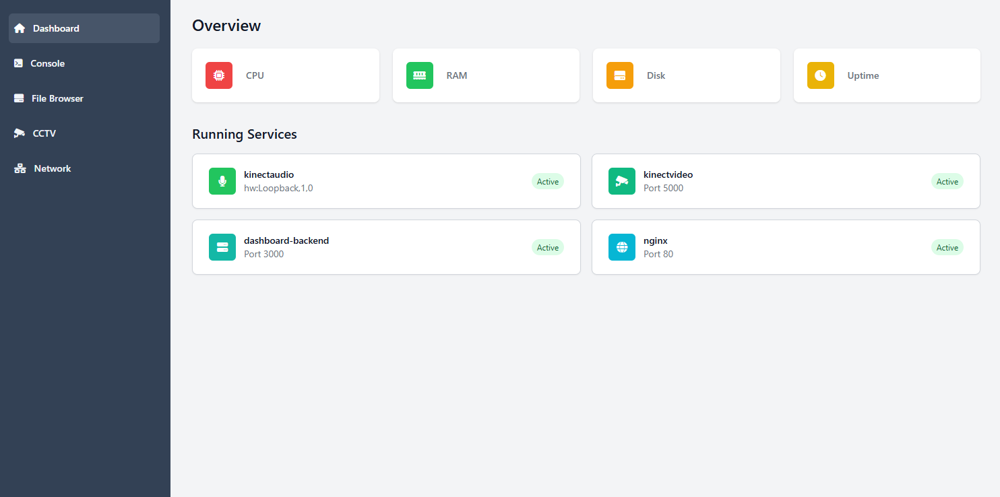
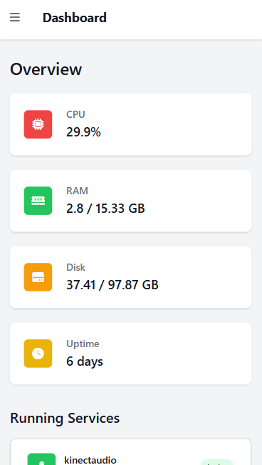

# Home Server Dashboard

A responsive, secure dashboard for monitoring your home server resources and services with both desktop and mobile support.

## Features

- Real-time System Monitoring showing CPU usage percentage, memory usage (used/total), disk space usage (used/total), and system uptime in days
- Service Status Monitoring with visual indicators, automatic checks every 5 seconds, and customizable service list
- Responsive Design with desktop sidebar navigation, mobile-friendly hamburger menu, and adaptive layout
- Security Features including password authentication, session management, and protected API endpoints

## Technologies Used

- Frontend: HTML5, CSS3 with Tailwind CSS styling, Font Awesome Pro icons, and JavaScript for dynamic updates  
- Backend: Python Flask framework with psutil for system monitoring and bcrypt for password hashing  
- Infrastructure: Nginx reverse proxy with Systemd service monitoring

## Installation

1. Prerequisites: Python 3.x, pip, Nginx, and Systemd  
2. Backend Setup: Install required packages with pip and run the dashboard.py script  
3. Frontend Setup: Place HTML files in the public directory  
4. Nginx Configuration: Configure as shown in the example nginx.conf  
5. Password Setup: Generate a bcrypt hash for your password  

## Configuration

Customize services monitoring by editing the services dictionary to match your systemd services  
Update security settings including session cookie name, domain, and redirect URL  
Modify the frontend navigation menu and stat cards as needed  

## Usage

1. Access the dashboard through your configured domain  
2. Enter the password to authenticate  
3. Monitor system resources and services in real-time  
4. Navigate between different sections using the sidebar  

## API Endpoints

- /stats/ - Returns system statistics  
- /services/ - Returns service status information  
- /auth - Handles password authentication  
- /auth-endpoint - Internal authentication check  

## Protection for Other Services

To add similar protection to other services via Nginx, use auth_request directive pointing to /auth-endpoint along with your proxy settings.

## Screenshots
  
*Desktop version of the dashboard*

  
*Mobile version of the dashboard*

## Contributing

Pull requests are welcome. For major changes, please open an issue first to discuss proposed changes.
